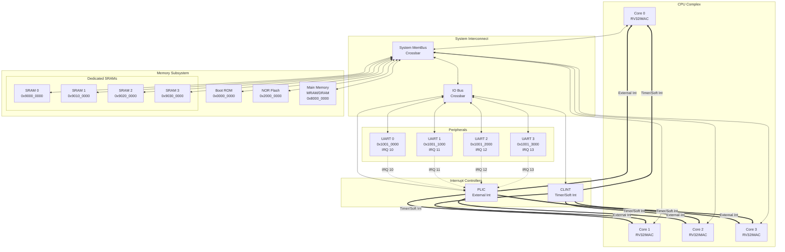

# Quad-Core AMP System Architecture

This document visualizes the hardware architecture simulated in Phase 3. The system is a Quad-Core RISC-V SoC designed for Asymmetric Multi-Processing (AMP) with independent IO for each core.

## Block Diagram

## Memory Map

| Region | Start Address | Size | Description |
| :--- | :--- | :--- | :--- |
| **Boot ROM** | `0x0000_0000` | 64 KB | Holds the Bootloader (`boot.S`) |
| **UART 0** | `0x1001_0000` | 4 KB | Console for Core 0 |
| **UART 1** | `0x1001_1000` | 4 KB | Console for Core 1 |
| **UART 2** | `0x1001_2000` | 4 KB | Console for Core 2 |
| **UART 3** | `0x1001_3000` | 4 KB | Console for Core 3 |
| **Flash** | `0x2000_0000` | 32 MB | XIP Storage (Unused in RAM boot) |
| **Main Mem** | `0x8000_0000` | 128 MB | Shared DRAM/MRAM |
| **SRAM 0** | `0x9000_0000` | 1 MB | Dedicated RAM for Core 0 Kernel |
| **SRAM 1** | `0x9010_0000` | 1 MB | Dedicated RAM for Core 1 Kernel |
| **SRAM 2** | `0x9020_0000` | 1 MB | Dedicated RAM for Core 2 Kernel |
| **SRAM 3** | `0x9030_0000` | 1 MB | Dedicated RAM for Core 3 Kernel |

## Interrupt Routing

| Peripheral | Interrupt ID | Target Core |
| :--- | :--- | :--- |
| **UART 0** | 10 | Core 0 |
| **UART 1** | 11 | Core 1 |
| **UART 2** | 12 | Core 2 |
| **UART 3** | 13 | Core 3 |

Each core is configured in Zephyr to listen to its specific UART interrupt line via the PLIC.
